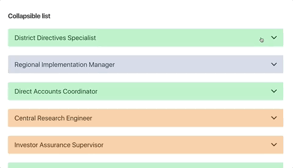
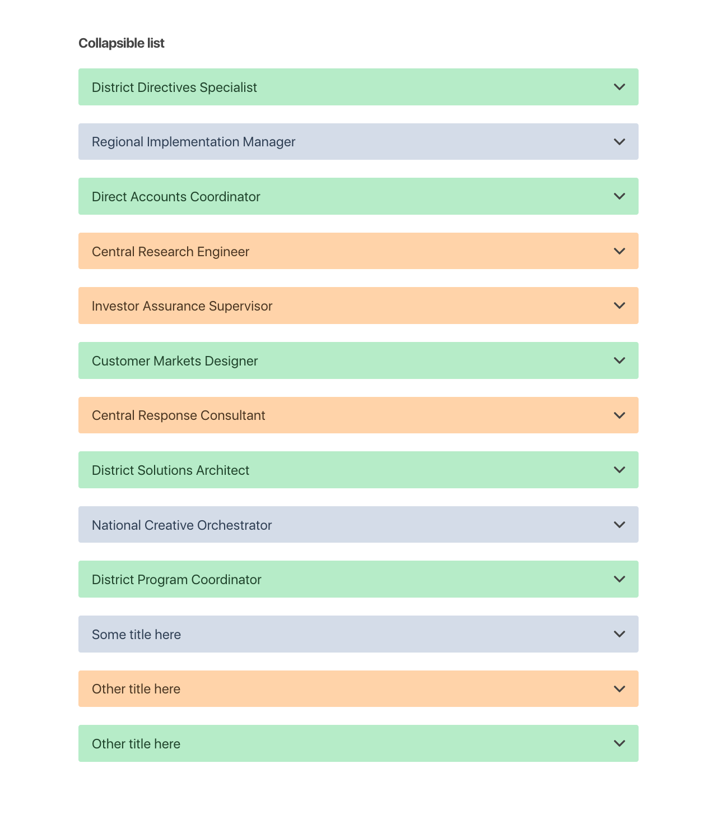
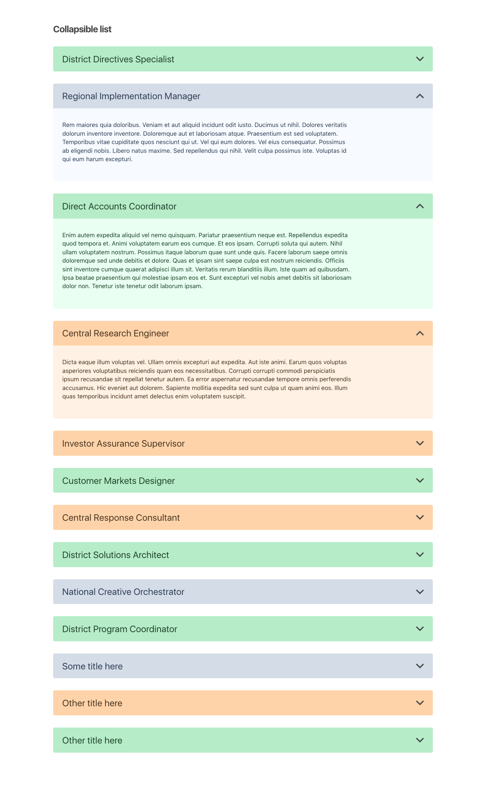

# Collapsible

Let's create a collapsible component that shows more content on click.

If the component is closed, on click it opens. If it is open, on click it closes. Each instance of the component should behave independantly of all the other instances.

The component should also have a theme. There are three possible themes: grayblue, orange and green. The grayblue theme is the default.

Use the faq (frequently asked questions) from the `data.json` file and display each in a collapsible component. Which theme to use depends on the category each item has.

Items in the `admin` category should appear in the orange theme,
`marketing` in green, and every other category in the default blue theme.

With all FAQ-s closed, they could look like this for example: 

With some FAQ-s open, they could look like this: 

* You can also animate the arrow (when FAQ is closed, the arrow looks down; when open - it turns up)
* Change document title to `Our FAQ`

> Use [CRA (create react app)](https://create-react-app.dev/) to bootstrap your project
